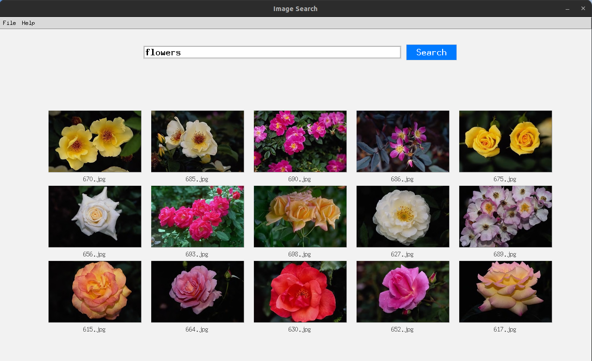

# Image Search Engine
Search images with natural language



## Installation
Install all dependencies:
```
pip install -r requirements.txt
```

## Build the Image Index
Generate CLIP embeddings and store them in a local database:
```
python indexer.py
```

## Demo
Launch the graphical interface and try searching:
```
python demo.py
```

## Contact
For questions, feedback, or collaboration:

sangkv.work@gmail.com

